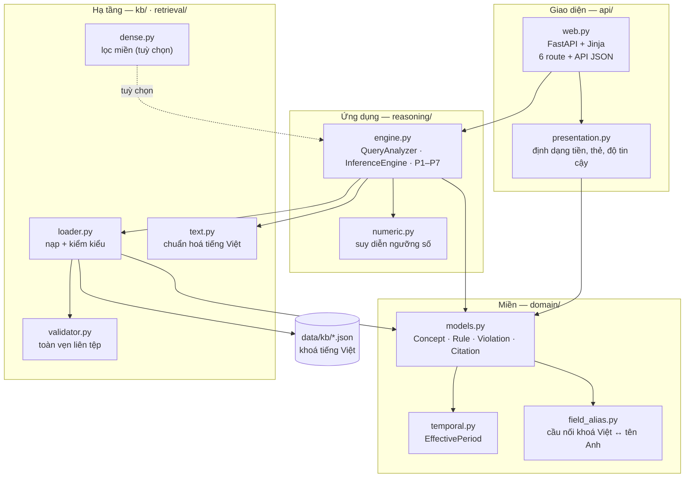
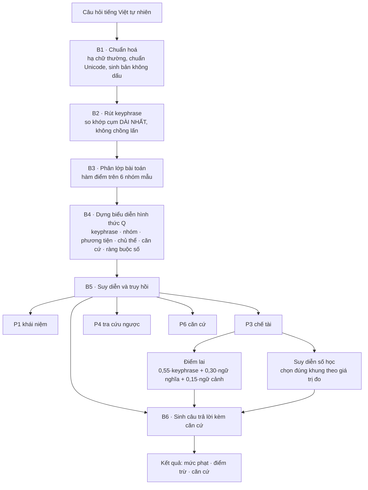
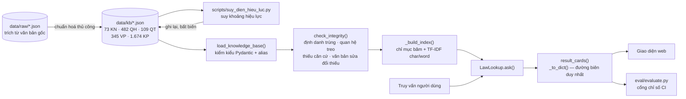

# Kiến trúc hệ thống

Hệ thống tra cứu kiến thức pháp luật giao thông đường bộ — CS106 Đề tài 4, Nhóm 7.

Tài liệu này mô tả **kiến trúc thực tế đang chạy**, kèm đánh giá thẳng thắn theo
Clean Architecture / DDD — gồm cả chỗ chưa đạt.

---

## 1. Kiến trúc phân tầng

**Chiều phụ thuộc**: giao diện → ứng dụng → miền. Tầng `domain/` chỉ phụ thuộc
`datetime`, `typing` và Pydantic — **không** biết gì về FastAPI, scikit-learn hay
định dạng JSON.

---

## 2. Luồng xử lý truy vấn B1 – B6

**Vì sao B2 khớp cụm dài nhất**: "nồng độ cồn" phải thắng "nồng độ" + "cồn" rời
rạc, nếu không sẽ trỏ sai mảng tri thức.

**Vì sao phân lớp không chặn kết quả**: sau khi bộ giải chạy, hệ thống luôn *bổ
sung* đủ ba loại tri thức nếu còn thiếu (ngưỡng 0,40). Nhờ vậy một câu bị phân
lớp sai vẫn có cơ hội trả đúng — đây là lý do Top-5 (95,00%) cao hơn hẳn Top-1
(76,67%).

---

## 3. Luồng dữ liệu

### Các màn hình thực tế

| Route | Màn hình |
|---|---|
| `/` · `/tra-cuu` | Tra cứu (gồm cả trạng thái không tìm thấy) |
| `/dieu-khoan/{ma}` | Chi tiết điều khoản |
| `/hieu-luc` | Hiệu lực theo thời gian |
| `/chu-de` | Duyệt chủ đề |
| `/chi-so` | Chỉ số đánh giá |
| `POST /api/ask` | API JSON |

Bản bàn giao mô tả 12 màn hình; hiện thực gộp lại thành **6 route responsive
từ 402 px tới 2560 px** — bản mobile không còn là route riêng mà là cùng một
trang co giãn theo bề rộng.

**Ba chốt chặn trên đường dữ liệu**: kiểm kiểu lúc nạp (Pydantic, cấm trường lạ) →
kiểm toàn vẹn liên tệp → cổng chỉ số trong CI.

---

## 4. Đánh giá theo Clean Architecture / DDD

### Đạt

| Nguyên tắc | Bằng chứng |
|---|---|
| Miền độc lập khung | `domain/` chỉ import `datetime`, `typing`, Pydantic |
| Ngôn ngữ thống nhất | `Violation`, `Citation`, `EffectivePeriod`, `Keyphrase` — khớp thuật ngữ pháp lý |
| Không có tên chung chung | Không có `utils.py`, `helpers/`, `common/`. `kb/text.py` chứa 3 hàm chuẩn hoá tiếng Việt có tên miền rõ |
| Tách logic khỏi giao diện | Định dạng nằm ở `presentation.py`, có test **đọc mã nguồn** `web.py` để chặn logic lọt vào vỏ |
| Đường biên kiểu tường minh | Tri thức là mô hình có kiểu xuyên suốt; đúng **một** hàm `_to_dict()` chuyển ra dict |
| Không truy vấn dữ liệu trong controller | `web.py` gọi `LawLookup.ask()`, không đọc JSON trực tiếp (trừ 2 tệp chỉ số tĩnh) |

### Chưa đạt — nêu thẳng

| Vấn đề | Thực tế | Ghi chú |
|---|---:|---|
| `reasoning/engine.py` quá dài | **1.018 dòng** | Skill đặt mốc 200 dòng/tệp. Đây là bản port nguyên văn; tách ra sẽ làm khó đối chiếu với bản gốc đã đo Top-1 76,67% |
| `api/web.py` dài | **599 dòng** | Nên tách route theo màn hình thành module riêng |
| Hàm dài trong engine | `_rank_violations` ~70 dòng | Trên mốc 50 dòng |

**Đánh giá trung thực:** hai vi phạm đầu là *có ý thức*, không phải sơ suất —
`pyproject.toml` từng ghi rõ việc dọn dẹp hoãn lại cho tới khi có cổng chỉ số.
Cổng đã có (ADR-0009), nên tách `engine.py` giờ là **nợ kỹ thuật đến hạn**, không
còn lý do hoãn. Hướng tách hợp lý: `query_analysis.py` (B1–B4), `ranking.py`
(hàm điểm), `solvers.py` (P1–P7), `rendering.py` (B6).

### Quyết định kiến trúc

Mười quyết định lớn ghi ở [`docs/adr/`](adr/README.md), mỗi cái kèm phương án bị
bác và lý do.

---

## 5. Xuất sơ đồ sang Word

Ba sơ đồ trên viết bằng Mermaid nên xem được ngay trên GitHub. Để đưa vào báo cáo:

1. Mở https://app.diagrams.net → **Extras → Edit Diagram** → dán mã Mermaid
   (draw.io tự chuyển thành hình khối sửa được), hoặc
2. Dùng bản draw.io cài sẵn: **Arrange → Insert → Advanced → Mermaid**
3. **File → Export as → PNG**, đặt tỉ lệ 2x cho nét khi in
4. Chèn vào Word, đánh số **Hình 1.**, **Hình 2.**, **Hình 3.** kèm chú thích

Báo cáo cần tối thiểu hai sơ đồ đầu (mục 3 — Thiết kế giải pháp).
